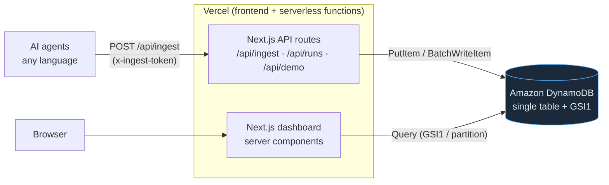

# Architecture

## Data model (single table `AgentLedger`)

| Item | pk | sk | GSI1PK | GSI1SK | Purpose |
|------|----|----|--------|--------|---------|
| Run summary | `RUN#<runId>` | `#META` | `RUNS` | `<startedAt>` | aggregated totals; listed newest-first via GSI1 |
| Event | `RUN#<runId>` | `EVT#<ts>#<seq>` | – | – | one model/tool/error event; queried by run partition |

- **List recent runs** → `Query GSI1 where GSI1PK = "RUNS"`, newest first.
- **Run detail** → `Query` the `RUN#<runId>` partition (meta + all events in one call).
- **Ingest** → read meta, accumulate totals, `BatchWriteItem` events + `PutItem` meta.

DynamoDB is the only datastore. There is no server to manage and no database cluster — Vercel's serverless functions talk HTTPS straight to DynamoDB. That is the "zero stack."
